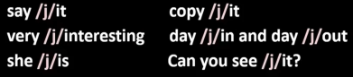
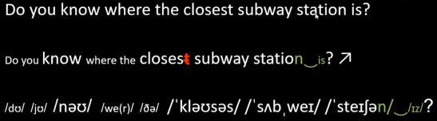

## 完美发音基础 1.元音

### 发音基础介绍

1. 音素：元音 辅音
2. 单词：重音 失去爆破 浊化 三单(第三人称单数) 过去式过去分词
3. 句子：语调 重音 弱读 连读 缩读
4. 段落：意群

    

### 音标概述

- 音标就是记录音素的符号，是音素的标写符号，它的制定原则是:`一个音素只用一个音标表示，一个音标只表示一个音素`。
- 音素的定义其实不难理解，在英文当中叫 phone 它是语音中最小的单位，依据音节里的发音动作来分析。
- 英语与汉语不同的是，英语是拼音文字，字母本身就表达语音。这就是我们常说的自然拼读法则。
- 然而，英语有 40 多个发音，却仅有 26 个字母。为了能准确标识发音，引入了语音符号，这些语音符号称作音标(Phonetic symbol)。

### 音标的种类

- 国际音标(IPA，International Phonetic Alphabet) ，是 1888 年国际语音协会的语言学家制定出的一套可国际通用的语音符号叫国际音标符号，希望以一个符号代表音，避免各人使用一套自己的符号所产生的不便。
- 除了 IPA 之外，比较常用的还有英式的 DJ 音标，以及美式的 K.k.音标，它们分别也都是国际音标的一种。
  - DJ 音标就是通常我们说的英式发音音标，由英国语音学家 DanielJones 研究出，由他的姓名首字母缩写 DJ 表示。
  - K.K.音标，是《美式英语发音辞典》 (APronouncing Dictionary of American English)所使用的音标。由于两位作者 John Samuel Kenyon 及 Thomas A.Knott 的姓皆以 K 为开头，所以此辞典俗称为 K.K.。K.K.音标的主要用途之一是教导母语非英语者学会美式英语的发音。
- 不管是哪一种音标，最终的目的都是辅助我们语言的学习，所以多认识一些种类才能更好的运用世界各大词典和理解语言书籍中的单词发音。
- 我们音标的基础课程还是以大家熟悉的国际音标为主同时也会为大家介绍常见的一些英式和英美不同的读音方式。
- 国际音标中共有 20 个元音，28 个辅音。
  
  
- 发音学习指南

  - 我们讲解音标的时候会分别为大家给出 IPA、DJ、KK 三种标示，可以让同学们更好地了解不同的书写方式，在查阅不同字典的时候都能自由应对。
  - 此外，在这顺便说一下音标符号的问题，//被称为宽式音标(broad transcription),[]被称为严式音标(narrow transcription)，严式意思是表示的音是确定的，不会再有音位的变化。一般语言学研究专家或者进行这方面研习的学者会使用“严式音标”，而我们在学习当中使用“宽式音标”//就可以。

    

## 完美发音基础 2.双元音

- 元音与辅音
  - 元首 Vowel: 发音过程当中气流无任何摩擦或阻碍
  - 辅音 Consonant :发音过程当中气流有摩擦或阻碍
- 单元音&双元音
  - 单元音:发音过程中嘴型无明显变化
  - 双元音:发音过程中嘴型有明显变化

  

## 完美发音基础 3.辅音


## 完美发音基础 4.辅音

- 舌侧音 l
  /l/音还有一个常用的用法，它常与爆破音/p/、/b/、/t/、/d/、/k/、/g/和摩擦音/f/、/v/、/s/、/z/及鼻辅音/m/、/n/连起来构成音节，成为辅音连缀，包括：/pl/、/bl/、/tl/、/dl/、/kl/、/gl/、/fl/、/vl/、/sl/、/zl/、/ml/、/nl/
- `念辅音时要记得犹抱琵琶半遮面，不要念的太重`

  

## 完美发音基础 5.单词发音

### 音节的定义

- 英语单词在发音的时候，不是一个字母一个字母的来发音，而是几个字母几个字母的拼起来发音。因此英语单词叫“拼音文字”，几个拼起来发音的字母叫一个“音节”。
- 音节是读音的基本单位，任何单词的读音，都是分解为一个音节朗读。
- 在英语中元音很响亮，一个元音可构成一个音节，一个元音和一个或几个辅音音素结合也可以构成一个音节。

### 音节的种类

- 音节可由以下组合构成：

  - 元音
  - 元音+辅音
  - 辅音+元音
  - 辅音+元音+辅音

- 一个音节的词：
  - i、oh、no、bad、play
- 两个音节的词：
  - fa/ther、a/gain、peo/ple
- 三个音节的词：
  - to/ge/ther、cer/tain/ly、fes/ti/val

### 音节如何划分
  1. 元音是构成音节的主体，辅音是音节的分界线。
  2. 两个辅音之间不管有多少个元音，一般都是一个音节。如：cat、head、meat、guess
  3. 两个元音字母之间有一个辅音字母时，辅音字母归后一音节。如：stu/dent、to/day、a/gain
  4. 有两个辅音字母时，一个辅音字母归前一音节，一个归后一音节。lit/tle、win/ter
  5. 不能拆分的字母组合按字母组合划分音节。如：fea/ther、tea/cher

### 开音节和闭音节

1. 绝对开音节：是指一个元音字母后面没有辅音字母而构成的音节如: she， hi， go
2. 相对开音节：是指一个元音字母后面有一个辅音字母（除 r）之外，最后一个不发音的 e 构成的音节。如：case、note、pine。`在开音节中，这个元音字母发“字母”本身音`
3. 闭音节：指元音字母后面有辅音字母（除 r）构成的音节。如 leg、cross、run、swim

### 单词的重音概述

- 一个英语单词，如果只由一个音节组成就不存在重音或轻音的问题。
- 如果由两个或两个以上的音节组成，就产生单词重音的问题，念的特别响的音节就是单词重音所在，也就是重读音节，其他音节叫非重读音节。
- 英语单词里除了一些复合词外，一般一个词只有一个重读音节，用 ' 符号来表示。
- 每个元音都有两个调，升调（类似汉语第一声）、降调（汉语第四声）

### 单词重读规则

- 单词重音和次重音：

  - 一般情况下一个单词只有一个重音，其他音节弱读，但是如果多音节词，有可能除了主重音外还有次重音。
  - 词的重音除了为句子的语调奠定基础外，还有标明单词词性的词义的功能。后面会有详细讲解。

    

### 单词发音-单音节单词

- 单音节词的一般规则：

  - 单音节词独立存在时要重读，而且不需要标出重音符号。

    

### 单词发音-双音节单词

- 双音节词的一般规则：

  1. 一般来说双音节词的重音在首音节上。

     

  2. 单音节词加上后缀（如：-er、-ly、-ing、-ed、-ful、-est、-less、-ness、-ish、-ress）构成的双音节词，重音也在第一个音节上。

     

  3. 含有 a-、ab-、es-、im-、ob-、de-、re-等词前缀的词，重音也常常在第二个音节上。

     

  4. 有一些复合词带有含意前缀，如 ex-(前任)，pre-(前)，post-(后),re-(再)等构成的双音节词，可以有两个重音。

     

  5. 少数没有词缀的双音节词重音落在第二个音节上，这些词很多是外来词。

     

### 单词发音-多音节单词

1. 三音节词的重音，一般在第一个音节上。

   

2. 三个音节以上的多音节词的重音，一般在倒数第三个音节上。次重音放在主重音前第二个音节上。

   

### 单词发音-特殊规则

- 除上述规则外，有些特例情况，要运用一些特殊规则判断单词的重音。

  1. 如果一个单词的动词形式和名词形式相同，那么其名词形式的重音一般在第一个音节上，动词形式的重音在最后一个音节上。这时，区分拼写相同的一个名词和一个动词时，即可通过重读部位进行判断。(名前动后)

     

  2. 含有-ful，-less，-ness 等词缀的单词，重音的位置与原来词根的重音位置相同。

     

  3. 含有-ity，-ion，-ical，-al 等词缀的单词重音在词缀音节的前一个音节上。

     

  4. 含有-tion 词缀的单词，重音在词缀音节部分的第一个音节上。

     

  5. 含有-acive 词缀的单词，如果只有三个音节，那么重音在首音节上。如果单词多于三个音节，则重音位置与原来词根的重音位置相同。

     

### 浊化

- 什么是浊化？
  浊化是指把清辅音发成与其相对应的浊辅音。辅音/s/后面的字母若原本应发/p/，/t/，/k/，则对应地变成/b/，/d/，/g/

  

### 失去爆破

- 什么是失去爆破？
  - 失去爆破指的是爆破音失去爆破。
- 发生条件如下：
  - 当前面的单词以/p/、/b/、/t/、/d/、/k/、/g/这六个爆破音中任意一个结尾，而紧随其后的单词以辅音开头，这时前面单词的爆破音失去爆破。
- 爆破音怎么读？
  - 读法是在发音时阻塞气流却不将之释放。
- 总结就是/p/、/b/、/t/、/d/、/k/、/g/ + 辅音 -> 失爆
  比如：good boy、hot day、fat cat、hot dog、great book、toilet paper

### 三单发音规则

1. 所有以清辅音结尾的动词在变三单时加 s，读作/s/。比如：stops、makes、drinks
2. 所有以浊辅音或者元音结尾的动词在变三单时加 s，读作/z/。比如：cleans、sings、plays、grows
3. 结尾是/t/音的动词在变三单时，要将最后的/t/和/s/读成/ts/。比如：sits、lifts、gets
4. 结尾是/d/音的动词在变三单时，要将最后的/d/和/z/读成/dz/。比如：reads、holds、nods
5. 以/s/、/z/、/ʃ/、/tʃ/结尾的动词在变第三人称单数时加 es，读作/iz/。比如：fixes、closes、washes、teaches、watches。\
以上规则总结顺口溜：清清、浊浊、元浊。

### 过去式、过去分词读音规则

1. 单词以清辅音结尾加-ed 读/t/。比如：stopped、liked、watched、pushed
2. 单词以浊辅音或元音结尾加-ed 读/d/。比如：lived、listened、pulled、played
3. 单词以字母 t、d 结尾加-ed 读/Id/。比如：visited、wanted、needed\
以上规则总结顺口溜：清清、浊浊、元浊。\


## 完美发音基础 6.句子发音技巧

- 读句子之重读-```实词重读：名形动副数 否助```

  

- 读句子之弱读-```代冠介连助 助```

  

  - 例子：

    

  - 特殊情况-有时候表达者想要强调的部分也可以重读结构词

    

- 句子语调（英语句子中没有平调，要么升调要么降调）
  - 升调：表示话还没有说完，等待对方立刻回复，或者不确定自己的观点。
    - 一般疑问句： 一般疑问句通常用声调，在句子最后一处实词上升，其他保持平调。

      

    - 祈使句：为表示委婉命令，祈使句也可采用声调，同时也可表达鼓励或者不直接的建议。

      
    
    - 特殊疑问句：用升调有时表示温和的批评或表示说话者没听清楚，请对方再重复一遍。

      

    - 陈述句：用升调，表示不肯定，惊讶，委婉等语气，也可起疑问作用。

      

    - 反意疑问句：表示说话者并不十分确定陈述部分所表达的信息，或者表示说话者并不强迫对方同意自己的观点，只是简单询问。

      

    - 问候句：问候句就是人们见面打招呼时说的话语，也包括离别时的用语

      

  - 降调：表示话说完了，对方不用立刻回复，确定自己的观点。
    - 陈述句：在最后一实词处向下降，表语义完结语气肯定，不需要征求对方的意见。

      
    - 特殊疑问句：用what、when、where、who、which、why、whose、how等特殊疑问词引导的疑问句，一般在句子末尾用降调

      

    - 祈使句：用来表达命令的句式，语气较强，一般用降调

      

    - 反意疑问句：陈述部分用降调，表示说话者预测对方会表示赞同

      

    - 读句子之升降混合用法 选择句前升后降

      

  - 句子中的连读规则
    - 辅音 + 元音型连读
      - 相邻的两个词中，前一个词的末尾是辅音，后一个词的开头是元音时，辅音和元音可以连读

        

      - 以辅音结尾的单词+h开头的单词h有时不发音，元音直接与前面的辅音连读（击穿现象）

        

    - 辅音 + 半元音连读
      - 在英文中，/j/和/w/是半元音，如果相邻两个词前一个词是以辅音结尾，后一个词以半元音开头，特别是/j/开头，此时也要连读

        

    - 元音 + 元音连读
      - 当相邻两词前一个以元音结尾，后一个以元音开头。一般可在元音之间加上/j/或者/w/,从而使纯元音音节之间的过渡变得自然、流畅，更加上口。\
      前面的单词以元音/i/,/e/结尾，紧随其后的单词以元音开头，这时在两个单词之间出现半元音/j/作为过渡。

        
      - 两个元音连读，当前面一个词以元音/u:或/u/结尾时，会产生一个轻微/w/，和后一个词的元音词链接。

        

    - r/re + 元音型连读
      - 如果相邻两词前一个词是以-r或者-re结尾，后一个词以元音开头，这时候r必须发音（无论英美音），读/r/，并与后一个单词的词首元音连续。

        
      - 练习

        

    - 句子中两个单词的同化&叠合
      - 同化（简单了解即可）：英语中两个单词的同化通常有如下两种情况：
          1. 辅音/d/与/j/相邻时，被同化为/dʒ/\
          Would you... Need you... Did you...
          2. 辅音/t/与/j/相邻时，被同化为/tʃ/\
          Nice to meet you. Fit you well
      - 叠合：前面单词结尾辅音与紧随其后的单词的起始辅音为同一个辅音时只需读一次，省略后一个\
      next time、some money、hot tea、part time job

  - 句子语音语调综合练习\
  \
  \
  \
  \
  

