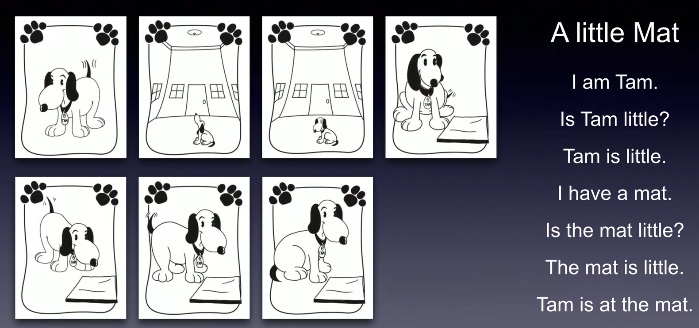

自然拼读又称“ Phonics”,它是以英语为母语国家的孩子学习英语读音与拼字,增进阅读能力与理解能力的教学法,更是以英语为第二语言的英语初学者学习发音规律与拼读技巧的教学法。
[视频](https://www.bilibili.com/video/BV14G4y1X7Fv?p=1)
教程应该使用的是ipa63

- 第一阶段：Aa-Zz的读音和在单词中的发音
- 第二阶段：Aa、Ee、Ii、Oo、Uu的短音
- 第三阶段：Aa、Ee、Ii、Oo、Uu的长音
- 第四阶段：常见辅音字母组合的发音
- 第五阶段：常见元音字母组合的发音
- 第六阶段：其他常见发音规律

---

### 第一阶段：Aa-Zz的读音和在单词中的发音

| 字母 | 读音 | 单词中的发音 |
| :-----: | :----: | :----: |
| A | /eɪ/ | /æ/ |
| B | /bi:/ | /b/ |
| C | /si:/ | /k/ |
| D | /di:/ | /d/ |
| E | /i:/ | /e/ |
| F | /ef/ | /f/ |
| G | /dʒiː/ | /g/ |
| H | /etʃ/ | /h/ |
| I | /aɪ/ | /i/ |
| J | /dʒeɪ/ | /dʒ/ |
| K | /kei/ | /k/ |
| L | /el/ | /l/ |
| M | /em/ | /m/ |
| N | /en/ | /n/ |
| O | /əʊ/ | /ɔ/ |
| P | /pi:/ | /p/ |
| Q | /kjuː/ | /kw/ |
| R | /ɑ:/ | /r/ |
| S | /es/ | /s/ |
| T | /ti:/ | /t/ |
| U | /juː/ | /ʌ/ |
| V | /vi:/ | /v/ |
| W | /'dʌb(ə)ljuː/ | /w/ |
| X | /eks/ | /ks/ |
| Y | /wai/ | /j/ |
| Z | /zi:/ | /z/|

### 第二阶段：Aa、Ee、Ii、Oo、Uu的短音
#### 字母分类
- 元音字母 A E I O U
- 半元音字母 Y
- 辅音字母 B C D F G H J K L M N P Q R S T V W X Z

#### 元音字母发短音
- 辅音字母（字母组合）+ 元音字母（一个）+ 辅音字母（字母组合）
ink
cat
swim
duck
truck

#### 字母在单词中的发音叫短音
>A： /æ/ 绵羊音\
E： /e/ 也的延长尾音\
I： /i/ 部队打数一、二、三的一\
O： /ɔ/ \
U： /ʌ/ 

#### A的短音
辅音字母（字母组合）+ a + 辅音字母（字母组合）
{:max-width: "300px"}\

两个辅音字母在一起只会发一个辅音字母的音\
ck /k/
ey /i:/
ou /
ea /i:/

用yes或no回答的句子叫一般疑问句