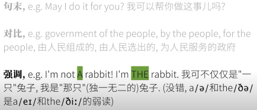
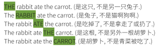

[笔记参照视频](https://www.youtube.com/watch?v=EvbqrgYwWWo&list=PLiRHe7F8P0-2Ll7FFuXyDDuODk3sEX5VP&index=1&pp=iAQB)


## 广义英语连读Connected Speech
- 连音 catenation/liaison =（侠义）英语连读
- 加音 intrusion
- 同化 assimilation
- 异化 dissimilation
- 省音（吞音）elision
- 弱读 reduction/weak forms

### 连音 catenation/liaison =（侠义）英语连读
- 以辅音结尾的单词的结尾辅音要发到位，不要加上不存在的元音
    - take it easy: take 的结尾不加不存在的元音，不说成ta课，it不说成伊特
    - in an instant:in和an的结尾鼻音发到位
- 意识到英文和中文发音习惯不同，比如鼻音
    - in、an vs mian ao棉袄
    - all of it 嗷嗷褔伊特/ɔl əv ɪt/

### 加音
- an apple 为什么是an不是a?
    - 英语：元音+元音=容易“糊”
    - 人工干预：
        - a -> an
        - 加音：加上一个之前不存在的“过渡音”，使得发音连贯
        ```注意：不是先有“加音”规则再照做，是先有加音现象在总结出规律```
            - 加w

                
            - 加y

                

            - 加r仅出现在英式中因为英式r结尾不发音。

                

                

### 同化
1. 逆行同化（前面音受后面音影响）
    - 无声除阻 unreleased stop

        
    - 浊音变清音 devoicing

        
    - 鼻化 nasalization

        
2. 顺行同化（后面音受前面音影响）
    - 复数词尾s（最主要）

        
3. 前后音互相作用
    - 融合 coalescence
    
        
    - 辅音延长 gemination

        

### 异化
- S

    
- R，在美式中当念起来比较拗口时去掉r化

    

### 省音
- 单词内省音
    - 通常省音：different
    - 可选择：similar
    - 必须/历史省音：debt、know、write

- 单词间省音
    - t的省音：last year
    - d的省音：you and me
    - h-dropping：tell her love her
    - g-dropping：how ya doin?
- more eg:
next door、most common、must be、you and me、give me that、What's his name?

### 连续弱读
一般发生在介、连、助动、代、冠之间，元音弱化为中间元音/ə/
- 介词：at for from of to
- 连词：and、but
- 助动词：am are have has do does would can could should
- 代词：you us them her
- 冠词：an some

    

### 缩读缩写
- 缩读例子
    ```
    want to = wanna\
    going to = gonna\
    have got to = totta\
    out of = outta\
    kind of = kinda\
    a lot of = a lotta\
    don't know = dunno\
    give me = gimme\
    would have = would've/would'a\
    you and i = you'n'l\
    come on = c'mon\
    what are you = wachya/watcha\
    what do you = whaddya/wadya\
    what did you = whatdja/wadja
    ```
- 缩写例子
    ```
    connot = can't
    goodbye = g'bye
    ```
- 母语者都嫌弃的缩写，只要是否定都可直接加ain't。ain't：am not、is not、are not、has not、have not、did not...


## 节奏(rhythm)重音规则
- 单词中有重读音节和非重读音节；重读音节之间的时长基本相等
- 汉语：“音节等时”syllable-timed
- 英语：“重音等时”stress-timed
    - 句中词语所花时间并非由音节数量的总数决定，而是由重读音节数量决定。（在不特意强调一句话中的信息时遵守）
    - 要知道句中那些词一般会弱读，一般不需要读出重音。
    - 中文没有弱读（如果不算轻声），需要特别重视
- 日语：“音拍等时”mora-timed

## 地道自然的英语（笔记没做完听的稀里糊涂...）
1. 语音
2. 节奏
3. 断句&停顿（意群划分）

    The rabbits that ate ```quickly became sleepy```\
    吃了东西的兔子，很快就决定困了（饿肚子的兔子不困）\
    The rabbits that ate quickly ```became sleepy```\
    吃得快的兔子，变得困了（吃得慢的兔子还挺精神）

4. 强调&响度≠节奏

    
5. 语气（说话方式）
6. 侠义语调
    - 英语语句中的单词的“音调/音高”的起伏变化
    - 语句中的某一处或某几处，音高持平，或者升高，或者降低，或者先升高在降低，或者先降低在升高
    - 英语的“声调”\
    请注意：英语理论上没有“声调”概念

## 不完全爆破，无声除阻
塞音+需成阻音->无声除阻


