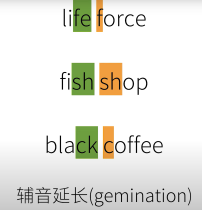

[笔记参照视频](https://www.youtube.com/watch?v=EvbqrgYwWWo&list=PLiRHe7F8P0-2Ll7FFuXyDDuODk3sEX5VP&index=1&pp=iAQB)


### 广义英语连读Connected Speech
- 连音 catenation/liaison =（侠义）英语连读
- 加音 intrusion
- 同化 assimilation
- 异化 dissimilation
- 省音（吞音）elision
- 弱读 reduction/weak forms

### 连音 catenation/liaison =（侠义）英语连读
- 以辅音结尾的单词的结尾辅音要发到位，不要加上不存在的元音
    - take it easy: take 的结尾不加不存在的元音，不说成ta课，it不说成伊特
    - in an instant:in和an的结尾鼻音发到位
- 意识到英文和中文发音习惯不同，比如鼻音
    - in、an vs mian ao棉袄
    - all of it 嗷嗷褔伊特/ɔl əv ɪt/

### 加音
- an apple 为什么是an不是a?
    - 英语：元音+元音=容易“糊”
    - 人工干预：
        - a -> an
        - 加音：加上一个之前不存在的“过渡音”，使得发音连贯
        ```注意：不是先有“加音”规则再照做，是先有加音现象在总结出规律```
            - 加w

                
            - 加y

                

            - 加r仅出现在英式中因为英式r结尾不发音。

                
                
                

### 同化
1. 逆行同化（前面音受后面音影响）
    - 无声除阻 unreleased stop

        
    - 浊音变清音 devoicing

        
    - 鼻化 nasalization

        
2. 顺行同化（后面音受前面音影响）
    - 复数词尾s（最主要）

        
3. 前后音互相作用
    - 融合 coalescence
    
        
    - 辅音延长 gemination

        

### 异化
- S

    
- R，在美式中当念起来比较拗口时去掉r化

    
